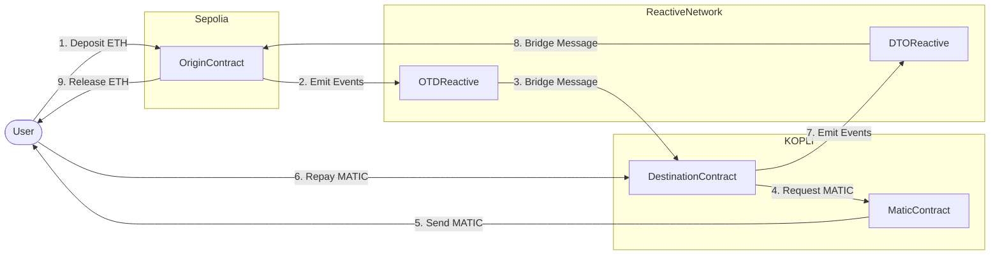

# Cross-Chain Lending Protocol

## Overview

A decentralized cross-chain lending protocol enabling users to borrow MATIC on KOPLI using ETH collateral on Ethereum Sepolia. The system leverages the Reactive Network for secure cross-chain communication and automated loan processing.

## Architecture

### Smart Contracts

1. **OriginContract (Sepolia)**
   - Manages ETH collateral
   - Initiates loan requests
   - Handles collateral release/liquidation

2. **MaticContract (KOPLI)**
   - Handles MATIC token operations
   - Manages loan disbursements
   - Processes repayments

3. **DestinationContract (KOPLI)**
   - Manages loan lifecycle
   - Handles loan approvals
   - Processes repayments and liquidations

4. **OTDReactive (Reactive Network)**
   - Bridges Origin-to-Destination communication
   - Handles cross-chain loan initiation
   - Processes collateral events

5. **DTOReactive (Reactive Network)**
   - Bridges Destination-to-Origin communication
   - Handles repayment confirmations
   - Processes liquidation events

## Contract Deployment Flow

### Step 1: Deploy OriginContract (Sepolia)
```bash
forge create --rpc-url $SEPOLIA_RPC --private-key $SEPOLIA_PRIVATE_KEY src/OriginContract.sol:OriginContract
```

### Step 2: Deploy MaticContract (KOPLI)
```bash
forge create --rpc-url $KOPLI_RPC --private-key $KOPLI_PRIVATE_KEY src/MaticContract.sol:MaticContract
```

### Step 3: Deploy DestinationContract (KOPLI)
```bash
forge create --rpc-url $KOPLI_RPC --private-key $KOPLI_PRIVATE_KEY src/DestinationContract.sol:DestinationContract --constructor-args $MATIC_CONTRACT_ADDR
```

### Step 4: Deploy OTDReactive (Reactive Network)
```bash
forge create --rpc-url $REACTIVE_RPC --private-key $REACTIVE_PRIVATE_KEY src/OTDReactive.sol:OTDReactive --constructor-args $SYSTEM_CONTRACT_ADDR $ORIGIN_CONTRACT_ADDR $DESTINATION_CONTRACT_ADDR
```

### Step 5: Deploy DTOReactive (Reactive Network)
```bash
forge create --rpc-url $REACTIVE_RPC --private-key $REACTIVE_PRIVATE_KEY src/DTOReactive.sol:DTOReactive --constructor-args $SYSTEM_CONTRACT_ADDR $DESTINATION_CONTRACT_ADDR $ORIGIN_CONTRACT_ADDR
```

## Contract Interactions



## Environment Setup

Required environment variables:
```
SEPOLIA_RPC
SEPOLIA_PRIVATE_KEY
KOPLI_RPC
KOPLI_PRIVATE_KEY
REACTIVE_RPC
REACTIVE_PRIVATE_KEY
SYSTEM_CONTRACT_ADDR
```

## Contract Addresses

```
# Ethereum Sepolia
ORIGIN_CONTRACT=0x590BEff93aF028D343Fd03e958d51C123f9aB7b6

# KOPLI Network
MATIC_CONTRACT=0x8ef4bc4EC0e3C29Ac484b1B015fd9B570133cdb6
DESTINATION_CONTRACT=0xF32c2c1cc9686D635f5D99ADb07E97a17877F134

# Reactive Network
OTD_REACTIVE=0x55033f19F97b1c8d1dCA347Da2f5F5b955F4B828
DTO_REACTIVE=0xd373C76D0922857E27556eFDAD4b39C475561C20
```

## Security Considerations

- Ensure proper access control for admin functions
- Validate all cross-chain messages
- Monitor collateral ratios
- Implement emergency pause functionality
- Regular security audits recommended

## Testing

For testing the protocol:
1. Deploy contracts in the specified order
2. Fund the contracts with test tokens
3. Test basic loan cycle:
   - Deposit collateral
   - Request loan
   - Receive MATIC
   - Repay loan
   - Retrieve collateral
4. Test edge cases:
   - Insufficient collateral
   - Failed repayments
   - Liquidation scenarios

## Limitations

- Test network implementation only
- Limited to ETH/MATIC pairs
- Basic interest rate model
- Simplified liquidation mechanism